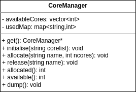

# CoreManager - Manage CPU Cores within application

CoreManager is a singleton class which should be initialised with a
list of CPU cores available to the application. Threads that require exclusive
access to a CPU core can then request a core from the CoreManager
which will allocate one of the cores from its list and set the CPU
affinity of the current thread. If no spare cores are available an
exception will be thrown. CoreManager keeps track of which module the
core was allocated to in a map, terminating threads should inform
CoreManager via the release method.

  

In this scheme, before instantiating DAQ modules, the application
framework obtains the available core information from OKS and
initialises CoreManager. It then makes a CoreManager requests for one
or more cores which will be used for unpinned threads.